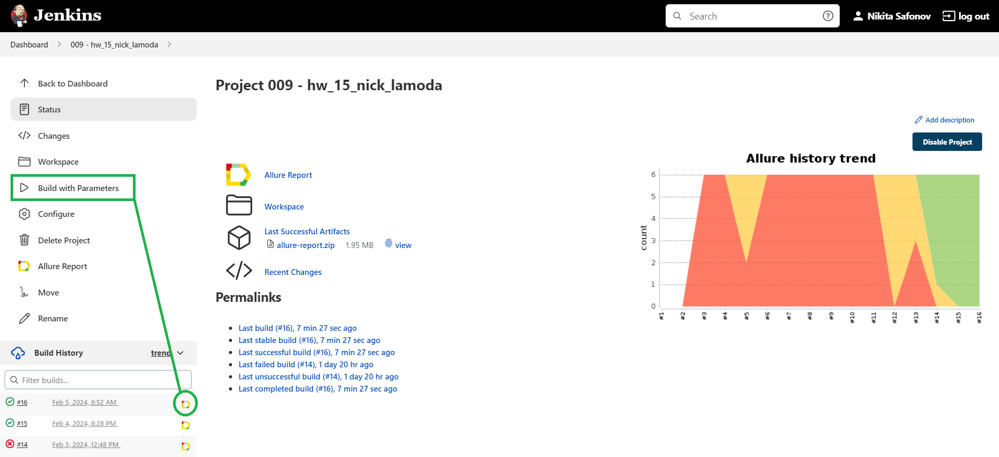
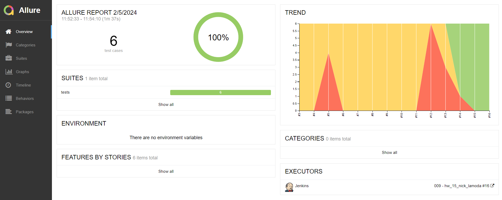
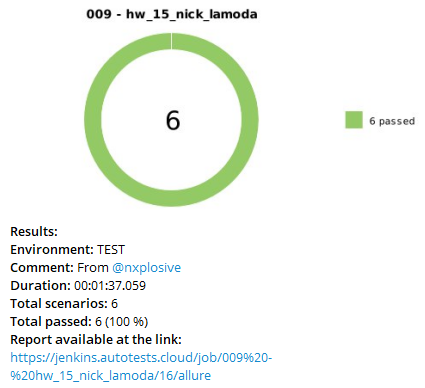

<h1 align="center">Проект по тестированию интернет-магазина <a href="https://www.lamoda.ru/"> Lamoda </a> </h1>

---

### Список реализованных автотестов

- [x] Добавление товара в корзину  
- [x] Удаление товара из корзины
- [x] Поиск товара по названию модели 
- [x] Проверка товара на соответствие бренду
- [x] Проверка товара на соответствие стоимости
- [x] Поиск несуществующего товара  

---

### Структура проекта 
Проект реализован с использованием 

#### Python, Selene, Pytest, Jenkins, Selenoid, Allure-report, Telegram
<p align="left">


</p>

---

### Запуск автотестов выполняется на сервере Jenkins

#### Как запустить

###### Удаленно

1. Открыть <a href="https://jenkins.autotests.cloud/job/009%20-%20hw_15_nick_lamoda/"> jenkins-control  </a>
2. Нажать Build now
3. Дождаться завершения 
4. Перейти в allure отчет

  

###### Локально

1. Клонируйте репозиторий
```ruby
git clone https://github.com/nxplosive/hw_9_15_lamoda.git
```
2. Создайте и активируйте виртуальное окружение
  ```ruby
  cd hw_9_15_lamoda
  python -m venv .venv
  .venv/Scripts/activate
  ```
3. Установите зависимости с помощью pip
  ```ruby
  pip install -r requirements.txt
  ```
3. Установите  <a href="https://repo.maven.apache.org/maven2/io/qameta/allure/allure-commandline/2.26.0/allure-commandline-2.26.0.zip"> Allure </a>. Распакуйте архив в папку с проектом. Распакованную папку переименуйте в "allure"
4. Запустите автотесты 
  ```ruby
  pytest tests
  ```
5. Получите отчёт allure командой
  ```ruby
allure/bin/allure.bat serve 
  ```
или
  ```ruby
allure serve tests\allure-results
  ```

---

### Результат запуска сборки в отчёте Allure

Отчёт о прохождении будет сгенерирован в allure-report с подробными шагами, скриншотами, видео.
Также, при необходимости можно подключить уведомления в Telegram, skype, discord, slack  

  

---

### Примеры выполнения тестов

  
  

---

### Настроено автоматическое оповещение о результатах в Telegram

.


